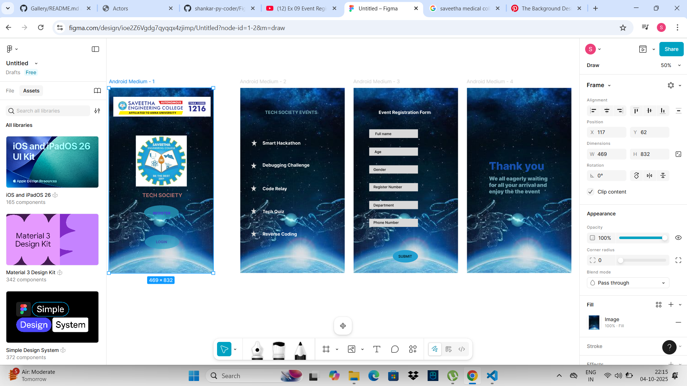

# Ex09 Event Registration Web Application
# Date:4-10-2025
# AIM:
To design, develop and deploy a web application for event registration.

# DESIGN STEPS:
## Step 1:
Create a new frame.

## Step 2:
Select any one preset size of your choice.

## Step 3:
Select the shapes you need.

## Step 4:
Import images as needed.

## Step 5:
Create pages based on your need and link them.

## Step 6:
Validate the HTML and CSS code.

## Step 6:
Publish the website in the given URL.

# DESIGN TOOL:
Figma

# CODE:

```
Event page:

<div class="container--0-">
  <div class="text-0-1-0">TECH SOCIETY EVENTS</div>
  <svg
    width="27"
    height="29"
    viewBox="0 0 27 29"
    fill="none"
    xmlns="http://www.w3.org/2000/svg"
  >
    <path
      d="M13.5 0L16.5309 10.7102H26.3393L18.4042 17.3295L21.4351 28.0398L13.5 21.4205L5.5649 28.0398L8.59584 17.3295L0.660737 10.7102H10.4691L13.5 0Z"
      fill="#D9D9D9"
    ></path></svg
  ><svg
    width="27"
    height="29"
    viewBox="0 0 27 29"
    fill="none"
    xmlns="http://www.w3.org/2000/svg"
  >
    <path
      d="M13.5 0L16.5309 10.7102H26.3393L18.4042 17.3295L21.4351 28.0398L13.5 21.4205L5.5649 28.0398L8.59584 17.3295L0.660737 10.7102H10.4691L13.5 0Z"
      fill="#D9D9D9"
    ></path></svg
  ><svg
    width="27"
    height="29"
    viewBox="0 0 27 29"
    fill="none"
    xmlns="http://www.w3.org/2000/svg"
  >
    <path
      d="M13.5 0L16.5309 10.7102H26.3393L18.4042 17.3295L21.4351 28.0398L13.5 21.4205L5.5649 28.0398L8.59584 17.3295L0.660737 10.7102H10.4691L13.5 0Z"
      fill="#D9D9D9"
    ></path></svg
  ><svg
    width="27"
    height="29"
    viewBox="0 0 27 29"
    fill="none"
    xmlns="http://www.w3.org/2000/svg"
  >
    <path
      d="M13.5 0L16.5309 10.7102H26.3393L18.4042 17.3295L21.4351 28.0398L13.5 21.4205L5.5649 28.0398L8.59584 17.3295L0.660737 10.7102H10.4691L13.5 0Z"
      fill="#D9D9D9"
    ></path></svg
  ><svg
    width="27"
    height="29"
    viewBox="0 0 27 29"
    fill="none"
    xmlns="http://www.w3.org/2000/svg"
  >
    <path
      d="M13.5 0L16.5309 10.7102H26.3393L18.4042 17.3295L21.4351 28.0398L13.5 21.4205L5.5649 28.0398L8.59584 17.3295L0.660737 10.7102H10.4691L13.5 0Z"
      fill="#D9D9D9"
    ></path></svg
  ><svg
    width="27"
    height="29"
    viewBox="0 0 27 29"
    fill="none"
    xmlns="http://www.w3.org/2000/svg"
  >
    <path
      d="M13.5 0L16.5309 10.7102H26.3393L18.4042 17.3295L21.4351 28.0398L13.5 21.4205L5.5649 28.0398L8.59584 17.3295L0.660737 10.7102H10.4691L13.5 0Z"
      fill="#D9D9D9"
    ></path>
  </svg>
  <div class="text-0-1-7">Smart Hackathon</div>
  <div class="text-0-1-8">Debugging Challenge</div>
  <div class="text-0-1-9">Code Relay</div>
  <div class="text-0-1-10">Tech Quiz</div>
  <div class="text-0-1-11">Reverse Coding</div>
</div>


```
# OUTPUT:




# RESULT:
The program to design, develop and deploy a web application for event registration is completed successfully.
